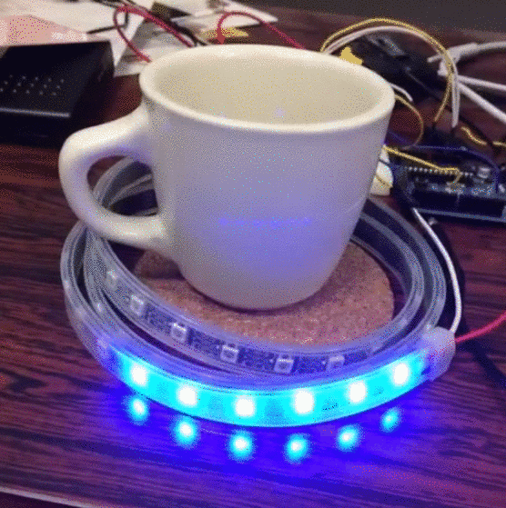

#LED Coaster
##概要
テープLEDと感圧シートを使った光るコースター
## 開発環境
### PC
+ Mac OSX Yosemite 
+ Arduino 1.6.5

### Arduino
+ Arduino Duemilanove

## 制作
###必要なもの
テープLED : [Adafruit NeoPixel Digital RGB LED Strip](http://www.adafruit.com/products/1138)  
感圧シート：[Pressure-Sensitive Conductive Sheet](https://www.adafruit.com/products/1361)  
導電糸：[Stainless Thin Conductive Thread](http://www.adafruit.com/products/640)

###テープLED
そのうち追加
###感圧シートと導電糸
そのうち追加
###回路
そのうち回路図を追加

###Arduino
1. [Arduino](https://www.arduino.cc/en/Main/Software)のインストール  
2. [Adafruitのライブラリ](https://github.com/adafruit/Adafruit_NeoPixel)をインストール  
3. `git clone https://github.com/valbeat/velostat.git`    
4. Arduinoを接続して velostat.ino を書き込む  

##デモ

